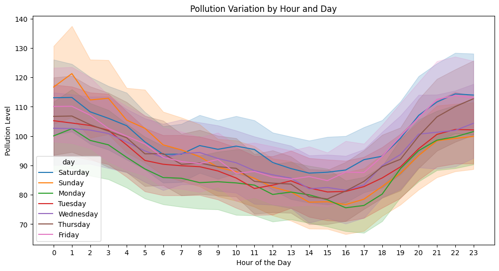
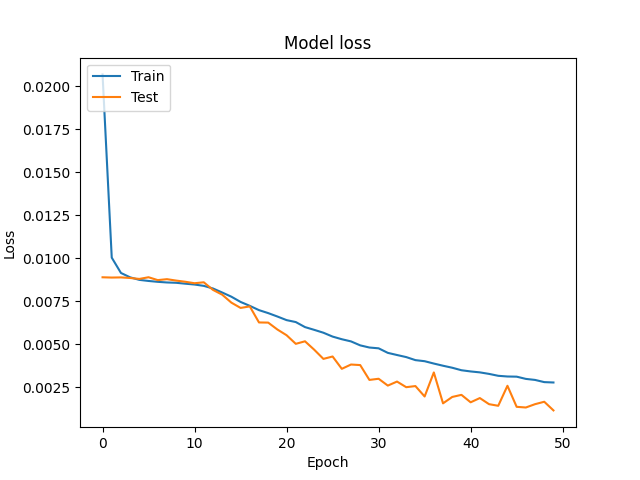
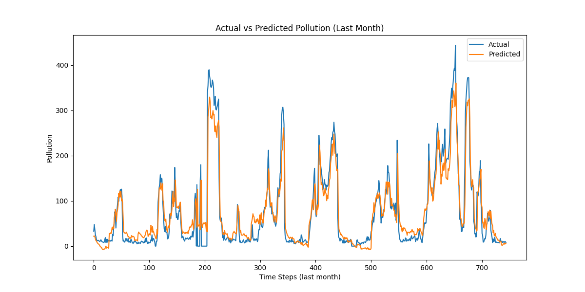

# **Air Pollution Forecasting - LSTM Multivariate**
## **Overview**  
This project demonstrates the application of Long Short-Term Memory (LSTM) networks for multivariate time-series forecasting. The goal is to predict air pollution levels based on historical environmental and meteorological data. By leveraging deep learning techniques, this project addresses challenges in air quality management, urban planning, and health risk mitigation.

---
## **Dataset**  
The dataset contains the following features: pollution (Target Variable), Temperature, Dew,Wind Speed, Wind direction, Snow, Date_Time.
For demonstration purposes, a synthetic dataset is created with realistic features. For real-world implementation, data from air quality monitoring stations or public repositories can be utilized.

---
## **Model Architecture**  
- **Number of Layers**:  2 LSTM layers.  
- **Units per Layer**: 1st Layer has 128 neurons and 2nd Layer has 32 neurons.
- **Optimizer**: Adam
- **GRU Architecture**: A deep learning model designed to capture temporal dependencies.  
- **Evaluation Metrics**: Utilized RMSE (Root Mean Squared Error) for assessing model performance.  
- **Visualization**: Forecasted vs. actual values to assess prediction accuracy.

